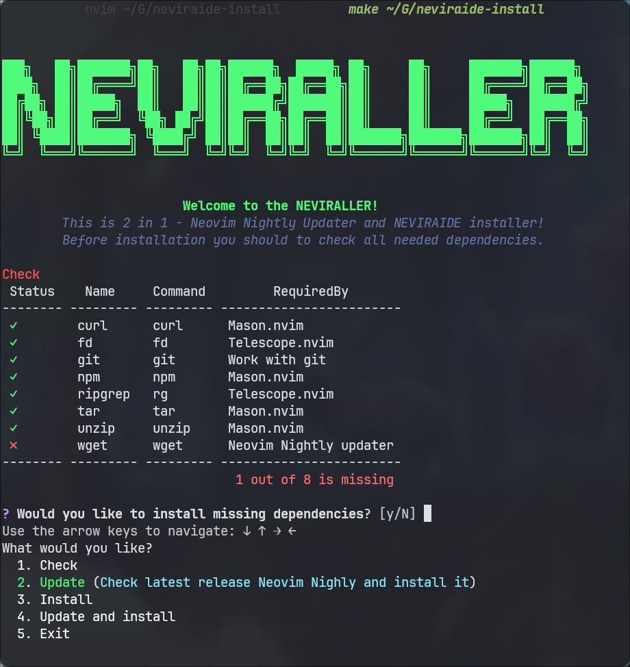

<h1>NEVIRALLER</h1>
<h3>For ArchLinux</h3>

This is 2 in 1 - <a href="https://github.com/neovim/neovim">Neovim</a> Nightly Updater and <a href="https://github.com/RAprogramm/NEVIRAIDE">NEVIRAIDE</a> installer!

---

## How to use?

1. Download [NEVIRALLER](https://github.com/RAprogramm/neviraide-install/releases/download/v1.0.0/NEVIRALLER)

in terminal

2. Go to your download directory and run `chmod +x NEVIRALLER`
3. Run `./NEVIRALLER`
